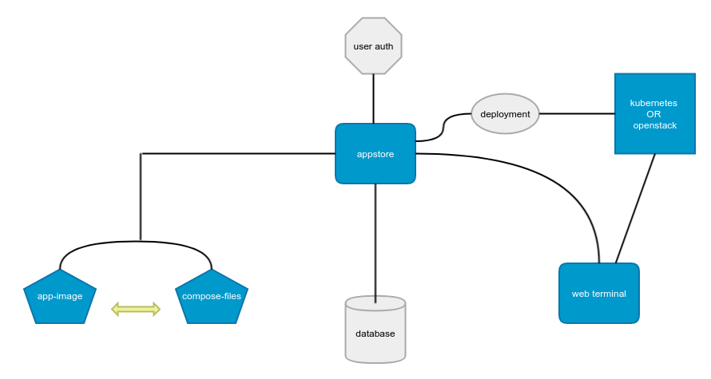

# Appstore with Cloud based University DataCenter
*powered by Kubernetes*

## Description
The project is aimed to provide an App-store like software delivery sys-
tem through a private cloud based university data center. Proposed plan
includes development of an Appstore for availability of applications cata-
logue, a private data-center for application deployment and web-portal for
easy accessibility as well as a standard application packaging format for
custom configured applications.

## tl;dr;
An appstore for students to easily access applications from university cloud without any need to install on local machines.
Project uses Kubernetes, Docker and Helm for infrastructure and applications
management and orchestration. Applications are deployed with Helm on university’s
private cloud powered by Kubernetes and are integrated with web-portal developed in python-flask.

## Note
This project is a work of a graduate student and is not ready for production or any sort of business need.

### Poster

### System Architecture

### Technologies Used
+ [Kubernetes](https://kubernetes.io/)
+ [Helm](https://helm.sh/)
+ [Swift](https://github.com/appscode/swift)
+ [Docker](https://www.docker.com/)
+ [Ansible](https://www.ansible.com/)
+ [Vagrant](https://www.vagrantup.com/)
+ [MongoDB](https://www.mongodb.com/)
+ [Python Flask](flask.pocoo.org/)
